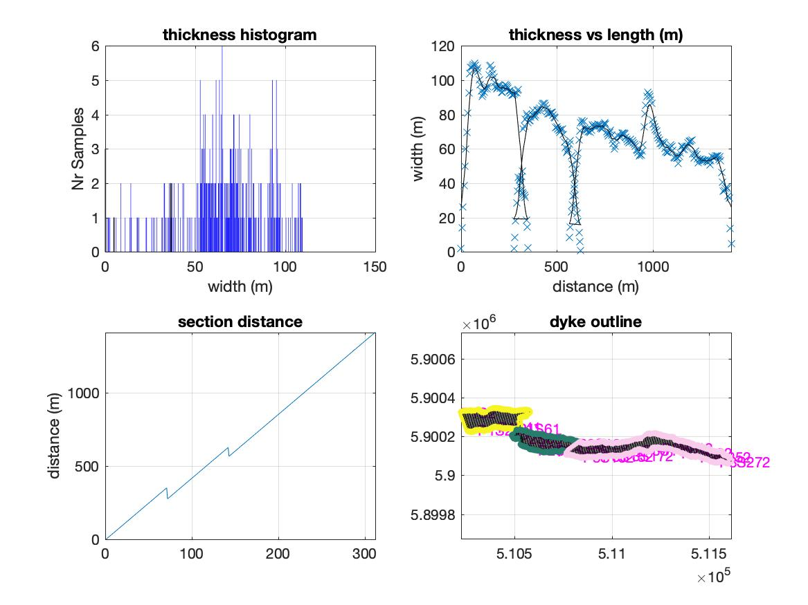

# Great_dyke_analysis

## Authors & Collaborators
Frank Guldstrand  
Tobias Schmiedel

## Purpose
This analysis is to quantitatively assess the geometry of dykes. We are using a case study with dykes from Argentina, however given a similar data input, it should be usable to analyse field data.
In detail: segment length, segment thickness, (tip geometry), (segment overlap), (segment relay zones),...
NB! Parameters in brakets are not implemented yet.

## License

## Dependencies
Move (generates data for the analysis from mapped dyke)  
Matlab  
Natsortfiles see(citation)  

## Data
Sets of coordinates from profiles along mapped dyke according segment.

## Code Description
The main script is dykeprof.m this accesses load_data.m, calculate_thickness.m and section_distance.m
natsort.m is used for sorting the files alphanumerically.

## Example / Tutorial
The structure is as follows:
    Test for Code Block

### Citations
Stephen Cobeldick (2020). Natural-Order Filename Sort (https://www.mathworks.com/matlabcentral/fileexchange/47434-natural-order-filename-sort), MATLAB Central File Exchange. Retrieved June 3, 2020.
